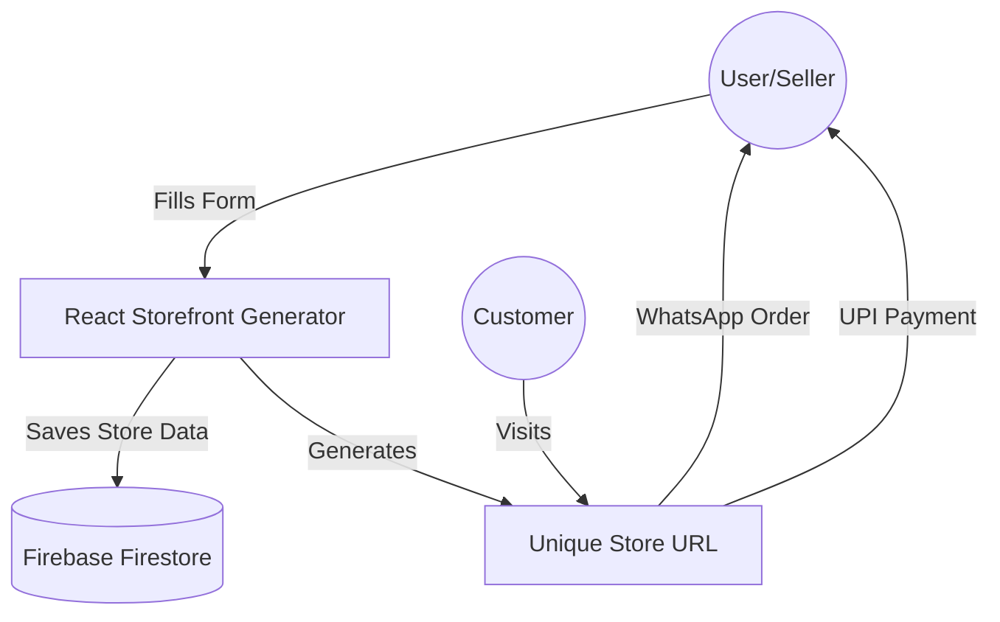

# 🚀 MicroStore Generator

**Instant Store Pages for Micro-Entrepreneurs**

[](https://micro-store-generator.vercel.app/)
[](https://reactjs.org/)
[](https://firebase.google.com/)

---

## 📝 Problem Statement

Micro-business owners and individual sellers often struggle with setting up complex e-commerce platforms. They need a **fast, zero-setup way** to showcase their products, receive orders via WhatsApp, and collect payments via UPI without the overhead of a traditional website. **MicroStore Generator** solves this by allowing anyone to create a professional storefront in seconds.

---

## 🏗️ Architecture Diagram



---

## ✨ Features

- **⚡ Instant Store Creation**: Generate a professional store page by simply filling a form.
- **📱 Mobile-First Design**: Optimized for small screens to ensure customers can browse easily.
- **💎 Premium Dark UI**: Modern aesthetics with Glassmorphism and electric indigo accents.
- **📞 One-Tap Connectivity**:
  - **Call Now**: Direct dialer integration for quick inquiries.
  - **WhatsApp Order**: Pre-filled message setup to receive orders instantly.
  - **UPI Payments**: Deep-link integration for seamless payments via Google Pay, PhonePe, or Paytm.
- **🔥 Serverless Backend**: Powered by Firebase Firestore for real-time data handling.

---

## 🛠️ Tech Stack

- **Frontend**: [React.js](https://reactjs.org/) (Vite)
- **Database**: [Firebase Firestore](https://firebase.google.com/docs/firestore)
- **Styling**: Vanilla CSS (Modern CSS3 with Variable-based Theming)
- **Routing**: [React Router v7](https://reactrouter.com/)
- **Deployment**: [Vercel](https://vercel.com/)

---

## 🚀 Installation Steps

Follow these steps to set up the project locally:

### 1. Clone the repository
```bash
git clone https://github.com/dilipnalage1063/MicroStore-Generator.git
cd MicroStore-Generator
```

### 2. Install Dependencies
```bash
npm install
```

### 3. Firebase Configuration
1. Create a project on [Firebase Console](https://console.firebase.google.com/).
2. Enable **Firestore Database**.
3. Create a **Web App** and copy your `firebaseConfig`.
4. Create a `.env` file in the root directory and add your credentials:
```env
VITE_FIREBASE_API_KEY=your_api_key
VITE_FIREBASE_AUTH_DOMAIN=your_auth_domain
VITE_FIREBASE_PROJECT_ID=your_project_id
VITE_FIREBASE_STORAGE_BUCKET=your_storage_bucket
VITE_FIREBASE_MESSAGING_SENDER_ID=your_messaging_sender_id
VITE_FIREBASE_APP_ID=your_app_id
```

### 4. Run Locally
```bash
npm run dev
```

---

## 🔗 Live Demo Links

- **Main Application**: [https://micro-store-generator.vercel.app/](https://micro-store-generator.vercel.app/)

---

## 📄 License

Distributed under the MIT License. See `LICENSE` for more information.

---
Built with ❤️ for Micro-Entrepreneurs by [Dilip Nalage](https://github.com/dilipnalage1063).
